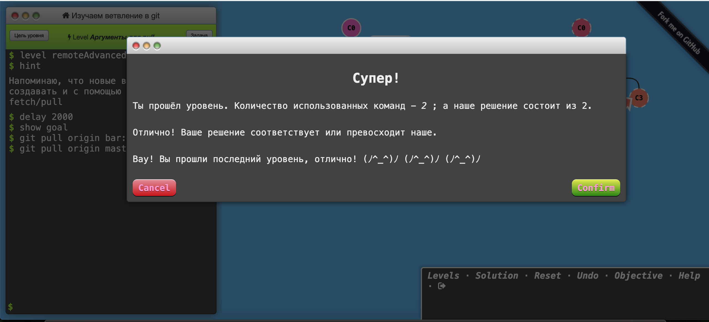

# kottans-frontend
---
## Basics

## Git Basics

It was very informative course for me! 
At first I finished Udacity course. There was a lot of interesting and new information about Git.
I learned many new concepts, how to:

* Create a Git repositirium
* Add commits
* Tagging
* Branching
* Merging
* Undoing changes

And after that I decided to practice with [LearnGitBranching](https://learngitbranching.js.org)
It was very helpful to understand:

* How branches works
* How to work with remote repos
* How to work in team with Git
* Git fetch command
* Git pull and push commands

## Linux CLI, and HTTP

During this part I repeated basics terminal commands with Linux Survival.
Some of them, (ex. grep) were new for me, I learned them and practice.

Articles about HTTP are very informative and useful.
I filled the gasps in knowledge about authentication, found out the difference between Basic Authentication and Digest Authentication - it was new information for me.
Also I expended my understanding HTTP caching: processing and controll headers.
