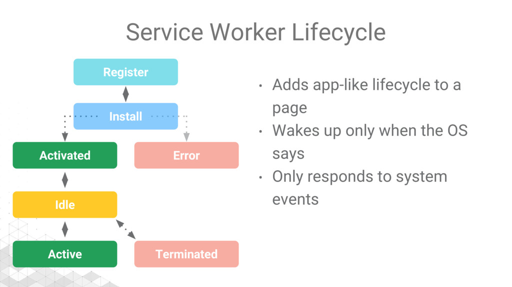
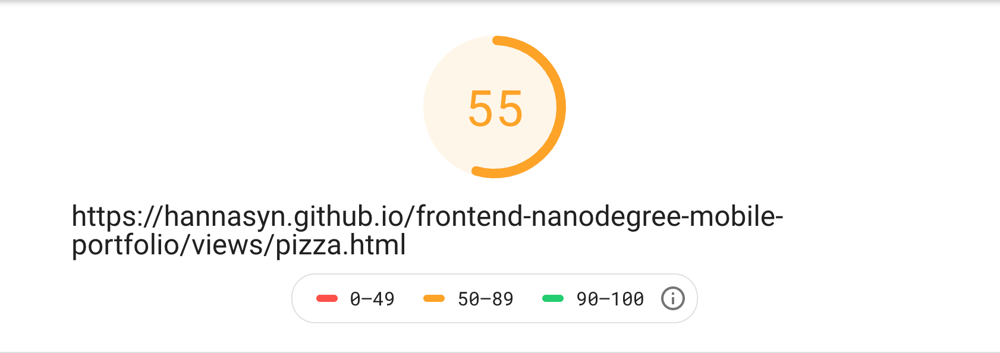

# :smiley_cat: kottans-frontend :heart_eyes_cat:

## My progress :rocket:

1. [Git Basics](#git_basics)
2. [Linux CLI, and HTTP](#linux_cli)
3. [Git Collaboration](#git_collab)
4. [Intro to HTML & CSS](#intro_html_css)
5. [Responsive Web Design](#responsive)
6. [HTML & CSS Practice](#hooli_popup)
7. [JavaScript Basics](#js_basics)
8. [Document Object Model](#dom)
9. [Building a Tiny JS World (pre-OOP)](#pre_oop)
10. [Object-Oriented JavaScript](#oop)
11. [OOP exercise](#post-oop)
12. [Memory – Pair Game](#memory-game)
13. [Friends App](#friends-app)
14. [Offline Web Applications](#offline_app)
15. [Website Performance Optimization](#website_performance)

## <a name="git_basics">Git Basics</a>

It was very informative course for me! 
At first I finished Udacity course. There was a lot of interesting and new information about Git.
I learned many new concepts, how to:

* Create a Git repositirium
* Add commits
* Tagging
* Branching
* Merging
* Undoing changes

Then I had practice with [LearnGitBranching](https://learngitbranching.js.org).
I learned how to branching, git pull and push commands.

## <a name="linux_cli">Linux CLI, and HTTP</a>

During this part I repeated basics terminal commands with Linux Survival.
Some of them, (ex. grep) were new for me, I learned them and practice.

Articles about HTTP are very informative and useful.
I filled the gasps in knowledge about authentication, found out the difference between Basic Authentication and Digest Authentication - it was new information for me.
Also I expended my understanding HTTP caching: processing and controll headers.

## <a name="git_collab">Git Collaboration</a>

[Udacity couse](https://classroom.udacity.com/courses/ud456) about GitHub was not completely new for me, I've already known mostly things.
I repeated and become more confident in knowledge about forks.
To get commits from a source repository into forked repository on GitHub I need to:

* Get the cloneable URL of the source repository
* Create a new remote with the git remote add command
* Use the shortname upstream to point to the source repository
* Provide the URL of the source repository
* Fetch the new upstream remote
* Merge the upstream's branch into a local branch
* Push the newly updated local branch to your origin repo

I was surprised how many different and useful commands that I can do with git rebase:

- use `p` or `pick` – to keep the commit as is
- use `r` or `reword` – to keep the commit's content but alter the commit message
- use `e` or `edit` – to keep the commit's content but stop before committing so that you can:
  * add new content or files
  * remove content or files
  * alter the content that was going to be committed
- use `s` or `squash` – to combine this commit's changes into the previous commit (the commit above it in the list)
- use `f` or `fixup` – to combine this commit's change into the previous one but drop the commit message
- use `x` or `exec` – to run a shell command
- use `d` or `drop` – to delete the commit.

I think that most of them I intend to use in future.

And after that I had practice with [LearnGitBranching](https://learngitbranching.js.org)
It was very helpful to understand:

* How branches works
* How to work with remote repos
* How to work in team with Git
* Git fetch command

## <a name="intro_html_css">Intro to HTML & CSS</a>

There was nothing new for me in [Intro to HTML and CSS Udacity](https://www.udacity.com/course/intro-to-html-and-css--ud001).
I already knew all the concepts and rules.

And [Basics of HTML5 course on CodeAcademy](https://www.codecademy.com/learn/learn-html) also wasn't new for me. I repeated semantic to write HTML cleaner.

[Basics of CSS3 course on CodeAcademy](https://www.codecademy.com/learn/learn-css) was the most interesting for me amoung this 3 courses.
I became more confident in `Grid Layout`, especially I interested in lesson [Advanced CSS GRID](https://www.codecademy.com/courses/learn-css/lessons/css-grid-ii/).

Now I have learned new properties to use when creating a layout using CSS Grid:

* `grid-template-areas` specifies grid named grid areas
* `grid-auto-rows` specifies the height of rows added implicitly to the grid
* `grid-auto-columns` specifies the width of columns added implicitly to the grid
* `grid-auto-flow` specifies in which direction implicit elements should be created

## <a name="responsive">Responsive Web Design</a> 

[Responsive Web Design Fundamentals course](https://www.udacity.com/course/responsive-web-design-fundamentals--ud893) was not really new for me, but I refresh my knowledge about mediaqueries and responsive tables.

I've already played this awesome game before, but with pleasure did it again! I always think about frogs, when use flexbox :frog: [Flexbox Froggy](http://flexboxfroggy.com/).

## <a name="hooli_popup">HTML & CSS Practice</a> 

[Demo](https://hannasyn.github.io/popup_task/) | [Code](https://github.com/HannaSyn/popup_task)

I've tryed really hard to create awesome popup :star_struck:
I think that I get it, because I love it :heart_eyes:

I've never done popups without JS before, so this expirience was so excited! 
I learned how to _create buttons with checkboxes_, and its beatuful, I confidently intend to use it in future!

## <a name="js_basics">JavaScript Basics</a> 

At first, during [Udacity JS basics course](https://classroom.udacity.com/courses/ud803), I refreshed my knowledge about types, loops and conditionals in JS. 

The second part was full of new methods and functions. 

* _Basic JS exercises_ - 111 tiny tasks - really useful to learn and practice in JS basics.
* _ES6 Challenges_ - I couldn't stop to solve it, and done all of them, it is very interesting.
* _Basic Data Structures_ - manipulate with most important types of JS - Objects and Arrays - really exciting, I finally find out the difference between `slice()` and `splice()` on practice.
* _Basic Algorithm Scripting_ - all the exercises were not so easy for me, but very interesting to solve.
* _Functional Programming_ - this part help me to understand what functional programming accually is:

  > Functional programming is about:
  >  * Isolated functions - there is no dependence on the state of the program, which includes global variables that are subject to change
  >  * Pure functions - the same input always gives the same output
  >  * Functions with limited side effects - any changes, or mutations, to the state of the program outside the function are carefully controlled

* _Algorithm Scripting Challenges_ :scream: -  it was the most dificult part for me. I've devided tasks on subtasks, looked for the hints or advice on MDN and google, but there were 2 times I've got a hint - in exercise "Diff two arrays" and "Pig latin". I guess, that I've learned my mistakes and fell gaps in skills. I itend to use loops more confidenty and often.

[_More screenshots here_](task_js_basics/)

## <a name="dom">Document Object Model</a> 

At the first topic, [JavaScript and the DOM](https://classroom.udacity.com/courses/ud117), I've learned, how to:
* Create content with JS
* Work with events
* Make event loops
* Use `setTimeout()` method

Also finish tasks at [freeCodeCamp](https://www.freecodecamp.org/learn/javascript-algorithms-and-data-structures/intermediate-algorithm-scripting/)

And done practical task: _Implement interactive side-menu site without page reloads._

[Demo](https://hannasyn.github.io/DOM-facts/) | [Code](https://github.com/HannaSyn/DOM-facts)

It was interesting and full of new knowledge topic. I really appreciate for reviews.

## <a name="pre_oop">Building a Tiny JS World (pre-OOP)</a> 

I built a tiny JS world model.

[Demo](https://hannasyn.github.io/a-tiny-JS-world/)

## <a name="oop">Object-Oriented JavaScript</a> 

Udacity oop course was full of new information for me.
Now I know about _Scopes_ and _Closures_, I became more confident and consciously use _this_.
It was interesting to listen and do quizes about _Classes_, _Subclasses_ and its _Patterns_.

Then I did practice - to create a arcade frogger-game.
Although was not easy, I was surprised, how great to build app with OOP. It was new expirience for me.

[Demo](https://hannasyn.github.io/frogger-game/) | [Code](https://github.com/HannaSyn/frogger-game)

Also I registered, joined Kottans clan, practiced tiny exercises at codewars and reached 7 kyu.

[My codewars profile](https://www.codewars.com/users/HannaSyn)

## <a name="post-oop">OOP Exercise</a> 

I improve app Tiny JS world. It was interesting - to work with hirarchy of classes, to learn modern ES6 syntax and how to use it. Try to use **S.O.L.I.D** and **D.R.Y.** principles.

[Demo](https://hannasyn.github.io/a-tiny-JS-world/) | [Code](https://github.com/HannaSyn/a-tiny-JS-world)

## <a name="memory-game">Memory – Pair Game</a>

I was really excited during creating this game, because it was new challenge for my knowledge about JS.
I think, that the result is really cool!

[Demo](https://hannasyn.github.io/Memory-pair-game/) | [Code](https://github.com/HannaSyn/Memory-pair-game)

I'm going to rewrite it according to OOP principles in future, I think, it will be another great challenge for me.

## <a name="friends-app">Friends App</a>

I created a tiny social friends' search page with users cards, search, sorting of them by age, name and filtering by gender.
This task helped me to understand, how works `fetch` and `async await`.
Really appreciate for reviews =)

[Demo](https://hannasyn.github.io/Friends_app/) | [Code](https://github.com/HannaSyn/Friends_app)

## <a name="offline_app">Offline Web Applications</a>

During this task I discovered the difference between a standart web app and an offline-first app.
`Service Workers` was totaly new for me, I found out, that they has a `lifecycle`:

This scheme helped me to understand stages of lifecycle.

`IndexedDB API` also was new for me. It lets developers store just about anything in the user's browser. It is a low-level API for client-side storage of significant amounts of structured data, including files/blobs. This API uses indexes to enable high performance searches of this data. 
In addition to the usual search, get, and put actions, IndexedDB also supports `transactions`.
`Transaction` - is wrapper around an operation, or group of operations, that ensures database integrity.

I definitely will use `IndexedDB API` along with `Service Workers` to write caching solutions that will help me to make an offline-first app.

## <a name="website_performance">Website Performance Optimization</a>

First of all, I read the article **Front-End Performance Checklist 2019**.
There are tonn of new and tough information for me.
I think it is very useful espesially at big projects to not forget about optimizations.
I downloaded this _checklist_ and will try to use it at practice step by step.

__Website Performance Optimization couse__ at Udacity was surpriced me.
Through it, I found out, what is a _Critical Rendering Path_. It is the path that the browser passes before the page is rendered in the browser.

In total, general strategies of website optimization are: 
1. Minimize bytes.
2. Reduce critical resourses.
3. Shorten _Critical Rendering Path_ length.

We need to minify, compress and cache files, use `mediaqueries` on `<link>`, use `async` attribute on `<script>`.

As final project I optimized views/pizza.html from 55 to 92. 

__Browser Rendering Optimization__ course explained common performance issues on the web.
I learned about the four parts of a web app's lifecycle: _RAIL_ (Response, Animate, Idle, and Load), how to use JavaScript to optimize animations and use web workers to speed up performance, how to manage page layers and improve page performance using the Chrome Dev Tools.

__Responsive Images course__ explained how to optimize images to display beautifully on all screen sizes, and about the difference between raster and vector images, responsive CSS units, and setting up optimization tools.
I was surprised to use the srcset attribute and the picture element to choose images of the right size for application for every viewing context.

Thanks to articles, I became more confident in understanding how to write optimized code, what is _repaints_ and _reflows_, and how it affected affected page speed. 
I will use it in my future projects. 

---

In conclusion, I want to emphasize, that I really appriciate for this Stage 0. I look at this repo, and see, how deep I dive, and how much I already know, and how much I don't know YET.
