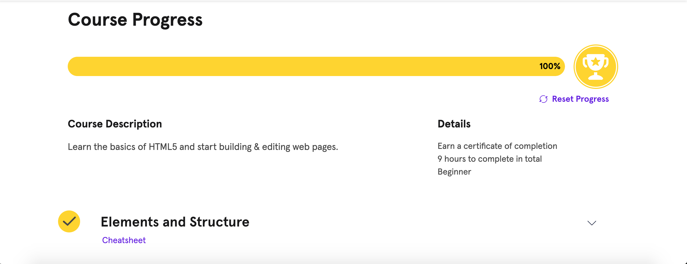

# kottans-frontend
---

## General

0. [Git Basics](#git_basics)
1. [Linux CLI, and HTTP](#linux_cli)
2. [Git Collaboration](#git_collab)

## Front-End Basics

3. [Intro to HTML & CSS](#intro_html_css)

## <a name="git_basics">Git Basics</a>

It was very informative course for me! 
At first I finished Udacity course. There was a lot of interesting and new information about Git.
I learned many new concepts, how to:

* Create a Git repositirium
* Add commits
* Tagging
* Branching
* Merging
* Undoing changes

## <a name="linux_cli">Linux CLI, and HTTP</a>

During this part I repeated basics terminal commands with Linux Survival.
Some of them, (ex. grep) were new for me, I learned them and practice.

Articles about HTTP are very informative and useful.
I filled the gasps in knowledge about authentication, found out the difference between Basic Authentication and Digest Authentication - it was new information for me.
Also I expended my understanding HTTP caching: processing and controll headers.

## <a name="git_collab">Git Collaboration</a>

[Udacity couse](https://classroom.udacity.com/courses/ud456) about GitHub was not completely new for me, I've already known mostly things.
I repeated and become more confident in knowlege about forks.
To get commits from a source repository into forked repository on GitHub I need to:

* Get the cloneable URL of the source repository
* Create a new remote with the git remote add command
* Use the shortname upstream to point to the source repository
* Provide the URL of the source repository
* Fetch the new upstream remote
* Merge the upstream's branch into a local branch
* Push the newly updated local branch to your origin repo

I was surprised how many different and useful commands that I can do with git rebase:

- use `p` or `pick` – to keep the commit as is
- use `r` or `reword` – to keep the commit's content but alter the commit message
- use `e` or `edit` – to keep the commit's content but stop before committing so that you can:
  * add new content or files
  * remove content or files
  * alter the content that was going to be committed
- use `s` or `squash` – to combine this commit's changes into the previous commit (the commit above it in the list)
- use `f` or `fixup` – to combine this commit's change into the previous one but drop the commit message
- use `x` or `exec` – to run a shell command
- use `d` or `drop` – to delete the commit.

I think that most of them I intend to use in future.

And after that I practice with [LearnGitBranching](https://learngitbranching.js.org)
It was very helpful to understand:

* How branches works
* How to work with remote repos
* How to work in team with Git
* Git fetch command
* Git pull and push commands

## <a name="intro_html_css">Intro to HTML & CSS</a>

There was nothing new for me in all 3 courses.
I already knew all this stuffs.

 Let’s review:

grid-template-areas specifies grid named grid areas
grid layouts are two-dimensional: they have a row, or inline, axis and a column, or block, axis.
justify-items specifies how individual elements should spread across the row axis
justify-content specifies how groups of elements should spread across the row axis
justify-self specifies how a single element should position itself with respect to the row axis
align-items specifies how individual elements should spread across the column axis
align-content specifies how groups of elements should spread across the column axis
align-self specifies how a single element should position itself with respect to the column axis
grid-auto-rows specifies the height of rows added implicitly to the grid
grid-auto-columns specifies the width of columns added implicitly to the grid
grid-auto-flow specifies in which direction implicit elements should be created
